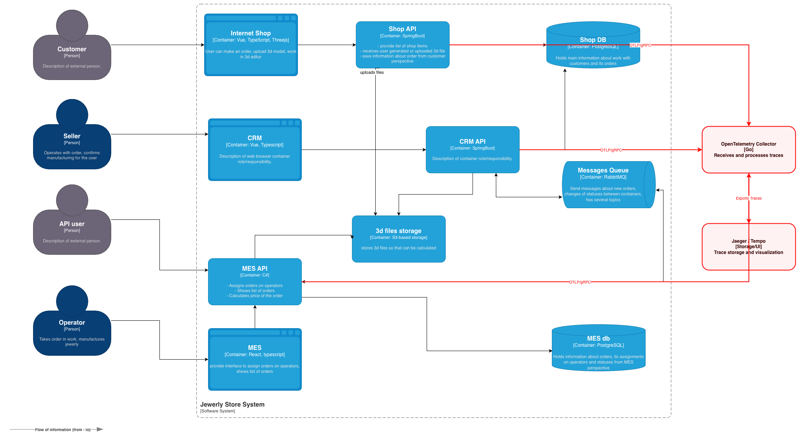
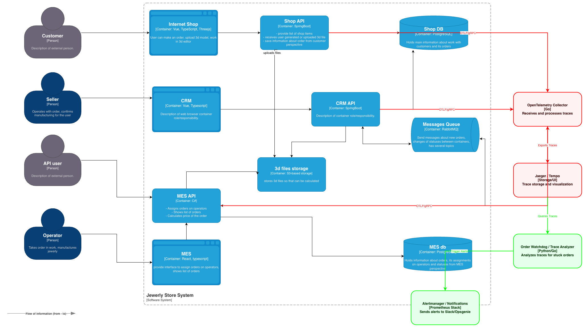
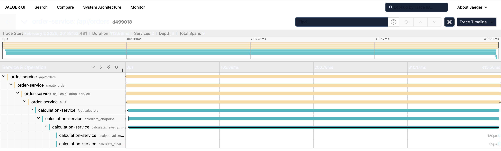

# Архитектурное решение по трейсингу

## Места для трейсинга

- Shop API: Начало жизненного цикла заказа. Здесь порождается trace_id.
- CRM API: Обработка изменений статусов и действий продавца.
- MES API: Самый сложный узел — расчет стоимости и назначение операторов.
- RabbitMQ (Header Propagation): Важнейшая часть. Трейсинг-контекст должен передаваться внутри заголовков (headers) сообщений, чтобы связать «отправителя» (Shop API) и «получателя» (MES API).

### Список данных

1. Общие (Global) атрибуты
   Добавляются во все сервисы (Shop, CRM, MES) для фильтрации данных.

- service.name: Название сервиса (например, shop-api, mes-api).
- deployment.environment: Среда (prod, staging, dev).
- service.version: Версия кода (чтобы понять, не вызвана ли ошибка новым релизом).
- trace.id: Уникальный идентификатор всей цепочки заказа (генерируется в Shop API или на UI).

2. Бизнес-данные
   Самые важные данные для связи технической ошибки с конкретным заказом.

- order.id: Идентификатор заказа. Это «ключ», по которому вы будете искать трейс, когда клиент пожалуется на задержку.
- customer.id: ID клиента (из Shop API), чтобы увидеть, не возникли ли проблемы у конкретного пользователя.
- model.id / file.id: ID 3D-модели при загрузке в S3. Позволит понять, на каком файле «завис» расчет цены в MES.
- order.status: Текущий статус заказа.
- operator.id: ID ювелира-оператора (в MES API), если заказ уже распределен.

3. Технические атрибуты по компонентам

#### HTTP (Shop API, CRM API, MES API)

- http.method: GET, POST и т.д.
- http.target: Конкретный эндпоинт.
- http.status_code
- http.user_agent

#### RabbitMQ (Messages Queue)

- messaging.system: rabbitmq.
- messaging.destination: Название обменника (Exchange) или очереди (Queue).
- messaging.rabbitmq.routing_key: Ключ маршрутизации.
- messaging.operation: send (публикация сообщения) или receive (обработка воркером).
- messaging.message_id: Чтобы сопоставить событие в RabbitMQ с логами брокера.

#### Базы данных (Shop DB, MES DB)

- db.system: postgresql.
- db.statement: Текст SQL-запроса (с маскированием персональных данных). Позволит найти «тяжелые» запросы, которые тормозят API.
- db.instance: Имя базы данных.

#### Хранилище (3D files storage / S3)

- s3.bucket: Имя бакета.
- s3.key: Путь к файлу 3D-модели.
- s3.upload_size: Размер файла (важно для анализа Latency — большие файлы грузятся дольше).

4. События и ошибки (Span Events)

- exception.type: Класс ошибки.
- exception.message: Текст ошибки.
- exception.stacktrace: Полный стек вызова для разработчиков.
- Log Events: Важные логи прямо внутри трейса (например, «Заказ отправлен на расчет цены»).

## Мотивация

Трейсинг позволит решить решить текущие проблемы системы, правильно подготовиться и провести масштабирование, предотвратить или правильно и своевременно отреагировать на будущие ошибки.
Метрики, на которые повлияет внедрение трейсинга:

- Response time
- Error rate
- Latency
- Retention

## Предлагаемое решение

1. **Сбор и передача данных (Instrumentation):**

- **Shop API и CRM API (Spring Boot/Java):** Внедрение **OpenTelemetry Java Agent**. Он автоматически перехватывает запросы к базе данных PostgreSQL, вызовы к S3 (через AWS SDK) и сообщения в RabbitMQ без изменения исходного кода.
- **MES API (.NET/C#):** Использование **OpenTelemetry .NET SDK**. Это позволит детально профилировать сложные расчеты стоимости, которые являются критическим узлом системы.
- **Frontend (Internet Shop/MES):** Интеграция `OpenTelemetry-js`. Это позволит отслеживать задержки при загрузке 3D-моделей из браузера.

2. **Проброс контекста (Context Propagation):**

- Будет использоваться стандарт **W3C Trace Context**.
- Для **RabbitMQ** необходимо доработать продюсеров и консьюмеров: при отправке сообщения в `headers` записывается `traceparent`, а при получении — извлекается, чтобы связать асинхронные цепочки.

3. **Инфраструктурные компоненты:**

- **OTel Collector (Центральный узел):** Принимает данные от всех сервисов по протоколу OTLP, агрегирует их и отправляет в хранилище. Это снижает нагрузку на сами приложения.
- **Jaeger / Grafana Tempo:** Выступает в роли бэкенда для хранения и визуализации трейсов.

### Изменения в архитектуре

### Мониторинг процесса и алертинг

В дополнение к сбору технических метрик (CPU, RAM, Errors), мы внедряем **бизнес-мониторинг прохождения заказа**, основанный на анализе цепочек трейсов.

#### 1. Автоматический мониторинг процесса (Trace Analysis)

Для этого внедряется новый компонент — **Order Watchdog (Trace Analyzer)**.

- **Механика:** Сервис периодически опрашивает хранилище трейсов (Jaeger/Tempo) или подписывается на поток спанов. Он восстанавливает состояние каждого заказа по его `order.id`.
- **Контрольные точки:** Система отслеживает время между критическими событиями:
- _Событие А:_ Заказ создан в Shop API.
- _Событие Б:_ Заказ принят MES API на расчет.
- _Событие В:_ Расчет цены завершен.

- **Детекция аномалий:** Если между событиями А и Б проходит более 5 минут (хотя сообщение должно долетать через RabbitMQ мгновенно), Watchdog идентифицирует заказ как «зависший».

#### 2. Система алертинга

Данные от Watchdog передаются в **Alertmanager** для оперативного реагирования.

- **Уровни оповещений:**
- **Warning:** Заказ находится в очереди RabbitMQ дольше 2 минут (сигнал о деградации потребителей). Отправляется сообщение в Slack/Telegram группы сопровождения.
- **Critical:** Заказ «пропал» (есть событие создания, но нет событий в MES API более 10 минут). Срабатывает **«звонилка»** (Opsgenie/PagerDuty) для дежурного инженера.
- **SLA Alert:** Среднее время расчета цены за последний час превысило 1 минуту. Заводится тикет в Jira на оптимизацию алгоритмов MES.

#### Изменения в архитектуре

## Компромиссы

### 1. Проприетарные и закрытые систем

Eсли в цепочке обработки заказа в «Александрите» участвует сторонний софт без открытого исходного кода или поддержки стандартов (например, специфическое ПО для 3D-принтеров или закрытая ERP-система), трейсинг там прерывается.

### 2. Стоимость хранения и передачи данных

Трейсинг генерирует огромный объем данных. Каждый вызов Shop API , каждое сообщение в RabbitMQ и каждый запрос к базе данных Shop DB создает запись (span).

- **Проблема:** Затраты на хранилище (например, Elasticsearch или ClickHouse для Jaeger) и оплату трафика в облаке могут стать заметной статьей расходов.

### 3. Производительность (Latency Overhead)

Хотя современные SDK (например, для .NET в MES API или Java в CRM API ) оптимизированы, они все равно потребляют ресурсы.

- **Проблема:** Добавление контекста (TraceID) в заголовки каждого сообщения RabbitMQ и формирование пакетов данных для отправки в коллектор создает нагрузку на CPU и увеличивает задержку (Latency).

### 4. Сторонние SaaS и внешние API

Если Shop API обращается к внешним сервисам (например, эквайринг для оплаты или облачный S3, который вы не контролируете), трейсинг там также будет ограничен «внешним» наблюдением.

## Безопасность

### 1. Доступ к интерфейсу визуализации (Jaeger / Grafana)

- **Аутентификация через SSO:** Доступ к дашбордам трейсинга осуществляется только через корпоративную систему (LDAP, Active Directory или Keycloak).
- **RBAC (Управление долями):**
- **Роль «Support»:** Просмотр трейсов без возможности изменения настроек системы.
- **Роль «Developer»:** Доступ к техническим деталям, стекам ошибок и SQL-запросам.
- **Роль «Admin»:** Настройка политик хранения (retention) и сэмплирования.

- **Скрытие от внешнего мира:** Интерфейс Jaeger **категорически запрещено** выставлять в публичный интернет. Доступ должен быть возможен только через **VPN** компании или внутреннюю сеть.

### 2. Безопасность передачи данных

- **TLS Шифрование:** Весь трафик по протоколу OTLP должен быть зашифрован с помощью TLS 1.2/1.3. Это исключает возможность прослушивания трафика внутри кластера.

### 3. Очистка и маскирование данных (PII Protection)

Трейсинг часто случайно захватывает персональные данные (PII — Personally Identifiable Information).

- **Маскирование на уровне Collector:** Настроить процессоры OpenTelemetry Collector для автоматического удаления или маскирования чувствительных полей в атрибутах (например, номера телефонов, email-адреса в параметрах запроса или пароли в SQL-логах).

### 4. Безопасность на стороне клиента (Internet Shop)

Так как Frontend-часть магазина тоже отправляет трейсы, это создает риск DoS-атаки на ваш Collector.

- **API Gateway / Rate Limiting:** Все трейсы от браузеров пользователей должны проходить через API Gateway или Ingress, который ограничивает количество запросов с одного IP-адреса.
- **OIDC/Token Auth:** Принимать трейсы от фронтенда только в том случае, если в заголовке есть валидный токен сессии пользователя.

## Трейсинг с OpenTelemetry и Jaeger

