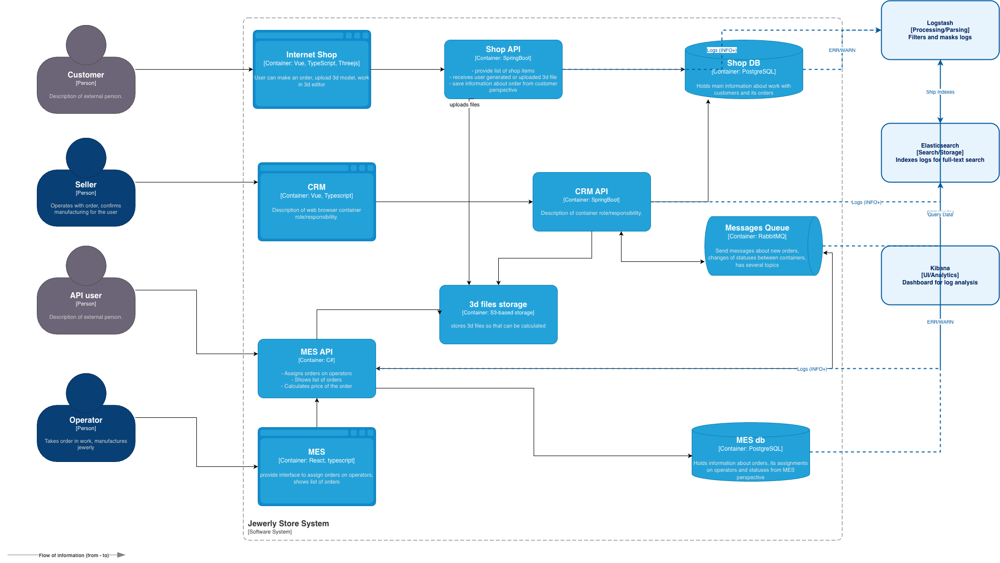

# Архитектурное решение по логированию

## Какие логи собираем

### Собираем логи из следующих систем:

- Shop API
- CRM API
- MES API
- Messages Queue
- Shop DB
- MES DB

### Типы логов с уровнем INFO

- Создание заказа
  - Время
  - ID покупателя
  - Номер заказа
  - ID товаров
- Изменение статуса заказа
  - Время
  - ID покупателя
  - Номер заказа
- Загрузка файла
  - Время
  - ID покупателя
  - Номер заказа
  - Мета данные файла
- Запрос расчета стоимости изделия
  - Время
  - ID покупателя
  - Данные изделия
- Создание/изменение статуса сообщения в messages queue
  - Время
  - ID
  - payload

Для баз данных будем использовать только уровни логов WARN, ERROR, FATAL. Также будем использовать эти уровни для Messages Queue. Все ошибочные запросы к API также будем логировать.

## Мотивация

Логирование позволит решить текущие проблемы системы: инженеры смогут быстрее реагировать на ошибки, будут понимать, что к ним привело и как их решить.
Метрики, на которые повлияет внедрение трейсинга (т.к. мы будем исправлять ошибки быстрее и эффективнее):

- Response time
- Error rate
- Latency
- Retention

В первую очередь логирование стоит внедрить для Shop API и MES Api, т.к. это наиболее проблемные части системы: пользователи и операторы взаимодействуют непосредственно с ними и часто жалуются на них.

## Предлагаемое решение

Для внедрения логирования будем использовать ELK стэк

1. **Filebeat (Агент):** Легковесный сборщик на каждом сервисе (Shop, CRM, MES API). Он читает логи и мгновенно пересылает их дальше.
2. **Logstash (Фильтр):** Принимает логи, парсит JSON, обогащает их и отправляет в Elasticsearch.
3. **Elasticsearch (Хранилище):**.
4. **Kibana (Визуализация):** Интерфейс для аналитики.

Для дополнительной визуализации можно подключить Grafana и Prometheus, но на первом этапе будет достаточно ELK.

### Безопасность и работа с данными

- **Маскирование:** На этапе Logstash мы настроим фильтры `mutate` или `grok`, чтобы вырезать персональные данные (email, телефоны) из логов создания заказа или загрузки файлов.
- **Доступ:** Вход в Kibana защищается через **Elastic Stack Security** (интеграция с вашей корпоративной учеткой). Сотрудники поддержки увидят только бизнес-логи, а администраторы — логи баз данных (Shop DB, MES DB).

### Политика хранения (ILM)

В Elasticsearch это реализуется через **Index Lifecycle Management**:

- **Hot (1-7 дней):** Логи на быстрых дисках, доступны для мгновенного поиска.
- **Warm (7-30 дней):** Логи переносятся на более дешевые диски.
- **Delete (после 90 дней):** Удаление индексов для экономии места.
- **Размер:** Под каждый сервис (особенно приоритетные Shop и MES API) выделяется отдельный индексный паттерн с лимитом по объему.

## Необходимые мероприятия для превращения системы сбора логов в систему анализа логов

### Настройка алертинга

Алертинг на основе логов позволяет ловить события, которые не всегда видны на графиках метрик (например, конкретный текст ошибки в теле ответа).

- **Алерты по порогу ошибок (Error Rate):** Если количество логов уровня `ERROR` или `FATAL` в Shop API или MES API превышает X за минуту, система должна отправить уведомление в Slack .

- **Алерты по бизнес-логике:** Настройка уведомлений на специфические события, например:

  - «Загрузка 3D-файла не удалась» (S3 Error) более 5 раз подряд для одного `customerId`.
  - «Ошибка расчета стоимости» в MES API для критически важных заказов.

- **Dead Letter Exchange (DLX) Alerts:** Хотя мы мониторим это через метрики, логи из RabbitMQ с пометкой о перемещении сообщения в DLX помогут сразу увидеть причину.

### Поиск аномалий

- **Детекция DDoS и бот-активности:**
- **Пример с заказами:** Резкий всплеск с 4 до 10 000 созданий заказов в секунду — это явная аномалия. В ELK это реализуется через **Machine Learning (ML) Jobs**, которые обучаются на историческом «базовом» уровне (Baseline) и бьют тревогу при резком выходе за пределы доверительного интервала.

- **Гео-аномалии:** Если обычно заказы идут из одного региона, а за секунду пошли тысячи запросов с IP-адресов другой страны, система должна пометить это как подозрительную активность.

- **Аномалии в цепочке статусов:** Если в логах CRM API зафиксирован переход заказа из «Новый» сразу в «Завершен», минуя «Расчет цены» в MES API, это признак либо бага в коде, либо несанкционированного вмешательства.

- **Аномалии производительности (Latent Anomalies):** Если время между логом «Запрос расчета стоимости» и «Расчет завершен» внезапно выросло на 300% для стандартных изделий, это повод для автоматического анализа очередей или нагрузки на БД.

### Мероприятия по реализации

Чтобы система стала аналитической, необходимо внедрить следующие компоненты:

1. **Парсинг и структурирование (Grok/Dissect):** Все логи должны быть строго типизированы. Поле `order_count` или `status` должно быть числовым/ключевым, чтобы по нему можно было строить математические модели.

2. **Использование Watcher (в ELK) или Alertmanager (в PLG):**

- **Watcher** позволяет запускать периодические запросы к Elasticsearch (например: «посчитай количество созданных заказов за последние 10 секунд») и сравнивать их с предыдущим периодом.

3.  **Корреляция логов с трейсингом:** Система анализа должна уметь по одному `trace_id` из подозрительного лога вытянуть всю цепочку событий, чтобы понять, является ли всплеск заказов ошибкой скрипта или реальной атакой.

4.  **Security Information and Event Management (SIEM) элементы:** Для защиты от DDoS логи Shop API должны коррелировать с логами Nginx/Ingress для блокировки подозрительных IP-адресов на уровне шлюза.

## Критерии для выбора технологии

| Критерий                           | **ELK Stack**                                   | **OpenSearch**                      | **PLG (Loki)**                             | **Splunk**                               |
| ---------------------------------- | ----------------------------------------------- | ----------------------------------- | ------------------------------------------ | ---------------------------------------- |
| **Лицензия**                       | Elastic License (SSPL)                          | Apache License 2.0                  | AGPLv3                                     | Проприетарная                            |
| **Потребление ресурсов (RAM/CPU)** | **Высокое** (требует много памяти для индексов) | **Высокое** (аналогично ELK)        | **Низкое** (индексирует только метаданные) | **Высокое** (тяжелая инфраструктура)     |
| **Полнотекстовый поиск**           | **Отличный** (индексирует каждое слово)         | **Отличный** (базируется на Lucene) | Ограниченный (grep-подобный поиск)         | **Лидер рынка**                          |
| **Стоимость хранения**             | Высокая (индексы увеличивают объем данных)      | Высокая                             | **Низкая** (высокая степень сжатия)        | Очень высокая (зависит от объема данных) |
| **Сложность внедрения**            | Средняя / Высокая                               | Средняя / Высокая                   | **Низкая** (простая интеграция с Grafana)  | Средняя (много «коробочных» функций)     |
