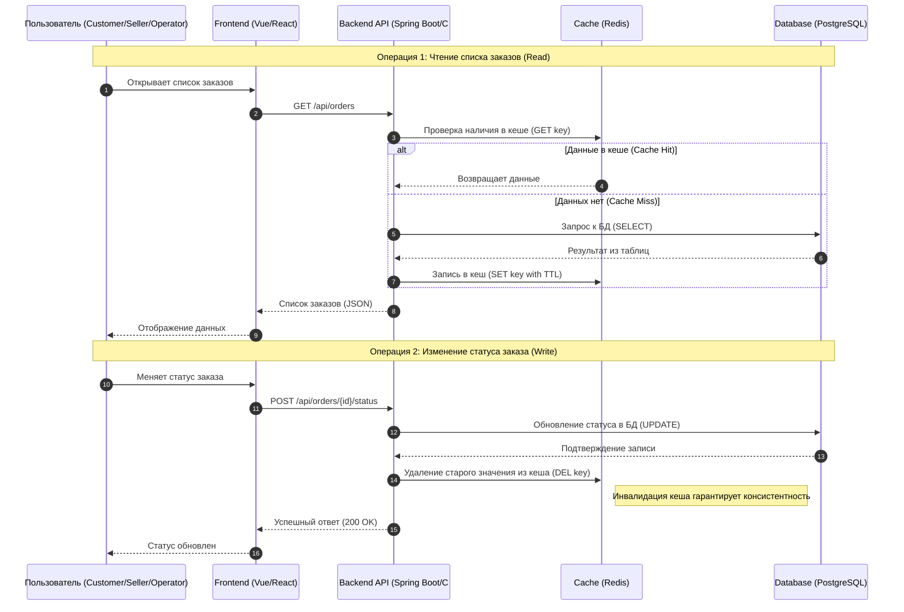

# Архитектурное решение по кешированию

## Мотивация

На основе описания системы и её архитектуры выделим три ключевые области, где кеширование принесёт наибольшую пользу:

### Каталог товаров (Shop API):

#### Что кешировать

Список доступных товаров и их базовые характеристики.

#### Обоснование

Это операция с высокой частотой чтения и редкими изменениями. Кеширование позволит пользователям мгновенно загружать витрину магазина, не нагружая Shop DB.

### Результаты расчета стоимости (MES API):

#### Что кешировать

Вычисленную стоимость для конкретных параметров изделий и хешей 3D-моделей.

#### Обоснование

Расчет цены — это сложная логика в MES API, которая может быть CPU-затратной. Кеширование позволит избежать повторных тяжелых вычислений для идентичных моделей.

### Метаданные и статусы заказов (CRM и MES):

#### Что кешировать

Краткую информацию по активным заказам для отображения в списках у продавцов и операторов.

#### Обоснование

Это снизит количество тяжелых запросов к базам данных Shop DB и MES db при каждом обновлении страниц личных кабинетов.

## Предлагаемое решение

Для системы «Александрит» наиболее эффективным и надежным решением будет внедрение серверного кеширования с использованием паттерна Cache-Aside.

### Почему серверное кеширование?

Несмотря на наличие фронтенд-приложений (Vue и React), клиентского кеширования (в браузере) недостаточно для решения основных проблем системы:

- **Консистентность данных:** В «Александрите» задействованы три разные роли (Покупатель, Продавец, Оператор), которые работают с одними и теми же заказами. Серверный кеш (Redis) гарантирует, что все они увидят актуальные статусы и цены практически одновременно.

- **Защита базы данных:** Инфраструктура использует одиночные инстансы БД в облаке. Серверное кеширование позволяет радикально снизить количество тяжелых запросов к БД на чтение (например, списки товаров или метаданные моделей), защищая базу от перегрузки.

- **Тяжелые вычисления:** Расчет цены в MES — ресурсоемкая операция. Результат вычисления на сервере можно переиспользовать для разных пользователей или при повторных запросах, что невозможно при хранении данных только на клиенте.

### Выбор паттерна: Cache-Aside

В качестве основного паттерна выбран **Cache-Aside (Lazy Loading)**. Приложение сначала ищет данные в кеше; если их там нет, читает из БД, записывает в кеш и возвращает пользователю.

#### Почему Cache-Aside подходит лучше всего:

1. **Устойчивость к сбоям:** Если сервис Redis временно станет недоступен, приложение продолжит работать напрямую с базой данных (хотя и медленнее). Для растущей системы с небольшой командой это критически важный аспект надежности.

2. **Гибкость данных:** В системе много разнородных данных (статусы, цены, файлы). Cache-Aside позволяет кешировать только те объекты, к которым реально обращаются пользователи, экономя дорогую оперативную память.

3. **Простота реализации:** Учитывая состав команды (два Java-инженера и один C#), этот паттерн проще всего внедрить с помощью стандартных библиотек (`Spring Cache` и `StackExchange.Redis`), не переписывая логику работы с БД.

### 3. Почему другие паттерны не подойдут или хуже

#### Write-Through

- Увеличивает задержку (latency) при каждой записи, так как данные должны быть успешно записаны и в кеш, и в БД.
- В системе много этапов записи (изменение статусов заказа). Лишняя задержка на запись в кеш здесь не оправдана, так как чтение происходит реже, чем обновление статусов операторами.

#### Refresh-Ahead

- Требует точного прогнозирования того, какие данные понадобятся пользователю в ближайшем будущем.
- В ювелирном магазине с индивидуальными 3D-моделями сложно предсказать, какой именно заказ или расчет понадобится следующим. Это приведет к бессмысленной нагрузке на БД и прогреву кеша данными, которые могут никогда не понадобиться. Кроме того, реализация фонового обновления значительно сложнее в разработке и поддержке.

### Стратегия инвалидации кеша

#### Программная + По ключу (для заказов):

Когда в MES API статус меняется на PRICE_CALCULATED, сервис программно удаляет ключ order:{id} из Redis.

Когда продавец в CRM одобряет производство (MANUFACTURING_APPROVED), он также «убивает» старый ключ по его ID.

Результат: Это гарантирует 100% точность данных для бизнеса. Остальные стратегии (особенно временная) не могут дать такой гарантии без риска показать клиенту неверную цену.

#### Временная (для статики):

Список камней или типов металлов в интернет-магазине меняется редко. Здесь мы ставим TTL (время жизни) на 1 час.

Результат: Мы экономим ресурсы разработчиков (которых всего 8 человек) и DevOps-инженера, не внедряя сложную инвалидацию там, где она не нужна.

### Сравнительный анализ стратегий

| Стратегия         | Плюсы                                                                    | Минусы                                                                                           | Почему (не) подходит для нас                                                                                               |
| ----------------- | ------------------------------------------------------------------------ | ------------------------------------------------------------------------------------------------ | -------------------------------------------------------------------------------------------------------------------------- |
| **Временная**     | Максимальная простота; не требует сложной логики в коде.                 | Риск рассинхрона данных; пользователь видит старый статус заказа.                                | **Подходит только для каталога.** Для заказов это опасно: оператор MES может не увидеть, что заказ закрыт в CRM.           |
| **На запросах**   | Гарантирует актуальность данных сразу после действий пользователя.       | Привязана к конкретным запросам; сложнее масштабировать.                                         | **Подходит частично.** Хорошо сработает для перехода от `INITIATED` к `SUBMITTED` в Shop API.                              |
| **На изменениях** | Данные всегда актуальны; автоматическая реакция на любой "чих" в БД.     | Очень высокая нагрузка на систему при частых правках; сложно реализовать в распределенной среде. | **Не подходит.** У нас базы данных разделены (Shop DB и MES db), отслеживать изменения во всех сразу будет слишком дорого. |
| **Программная**   | **Гибкость и контроль.** Мы сами решаем, когда "выкинуть" старые данные. | Требует ручного написания кода в каждом сервисе (Java/C#).                                       | **Лучший выбор.** Позволяет точечно управлять кешем в MES API и CRM API при смене статусов.                                |
| **По ключу**      | **Минимальный объем инвалидации.** Очищается только то, что изменилось.  | Нужно строго следить за именованием ключей во всех сервисах.                                     | **Обязательна к внедрению.** Позволяет обновить инфу по конкретному `order_id`, не сбрасывая кеш всего магазина.           |

#### Почему другие стратегии хуже

- Только временная: Если установить длинный TTL (например, 10 минут), то покупатель может оплатить заказ, а продавец в CRM еще 10 минут будет видеть его как «Новый», что приведет к операционным ошибкам.
- Инвалидация на изменениях в нашей архитектуре с Managed DB в облаке потребует настройки CDC (Change Data Capture) или триггеров, что излишне усложнит поддержку для маленькой команды.
- Инвалидация на запросах хороша для простых монолитов. Для «Александрита», где есть несколько сервисов, которые общаются через очереди сообщений, она ненадежна.
